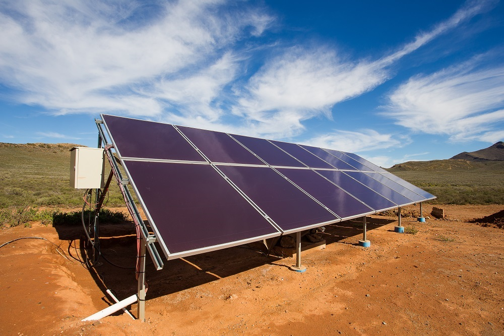
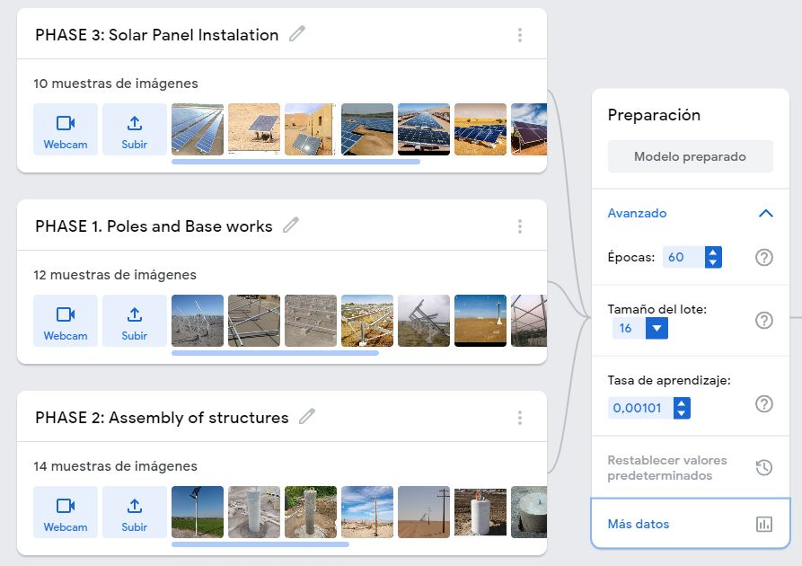
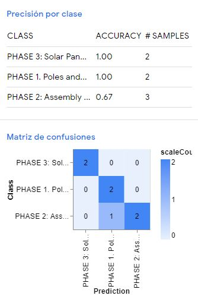
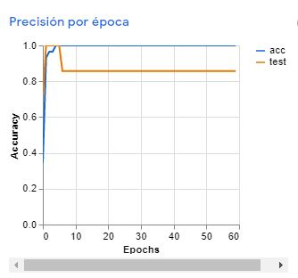
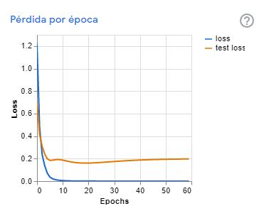

# Artificial intelligence (AI) with Tensorflow for PV monitoring
Artificial intelligence (AI) model using Tensorflow to automatically detect the progress of works in the execution of photovoltaic projects.

The model is based on a series of images from [IP](https://es.wikipedia.org/wiki/C%C3%A1mara_IP) video cameras (video) located in-situ, which serve to train a model of **[IA](https://towardsdatascience.com/search?q=Artificial%20inteligent)** which performs for each dataset an analysis on more than 10,000 images. This allows to classify in real time the progress of the construction activities in 3 phases or stages of the PV photovoltaic project.

</img>
 

## Parameters
**Learning rate** of = 0.00101
**Cycles or epochs** = 60 
**number of lots / images** = 16

## How does it work:

</img>

The model is based on a series of images from [IP](https://es.wikipedia.org/wiki/C%C3%A1mara_IP) video cameras (video) located in-situ, which serve to train a model of **[IA](https://towardsdatascience.com/search?q=Artificial%20inteligent)** which performs for each dataset an analysis on more than 10,000 images. This allows to classify in real time the progress of the construction activities in 3 phases or stages of the PV photovoltaic project.
* 1. PHASE 1. Poles and Base works
* 2. PHASE 2: Assembly of structures
* 3. PHASE 3: Solar Panel Instalation

The model can calculate the pressure for each class, in order to adjust the training images as needed:

</img>

During training we calculate the accuracy or classification percentage of the model. Assuming only results above 0.70:

</img>

We also calculate the learning loss or learning level of the model, in order to predict the correct classification for the data set: 

</img>

## The model contains:

The model architecture, used by TensorFlow.js 
* [library:](https://github.com/Alexanderariza/Tensorflow_PV/blob/main/model.json)
* [the model metadata, for example class labels and version of library:](https://github.com/Alexanderariza/Tensorflow_PV/blob/main/metadata.json)
* [TensorFlow.js binary file containing the model weights:](https://github.com/Alexanderariza/Tensorflow_PV/blob/main/weights.bin)

## Example link:

**[script OPS](https://teachablemachine.withgoogle.com/models/NSo_FKt9i/)**
 
